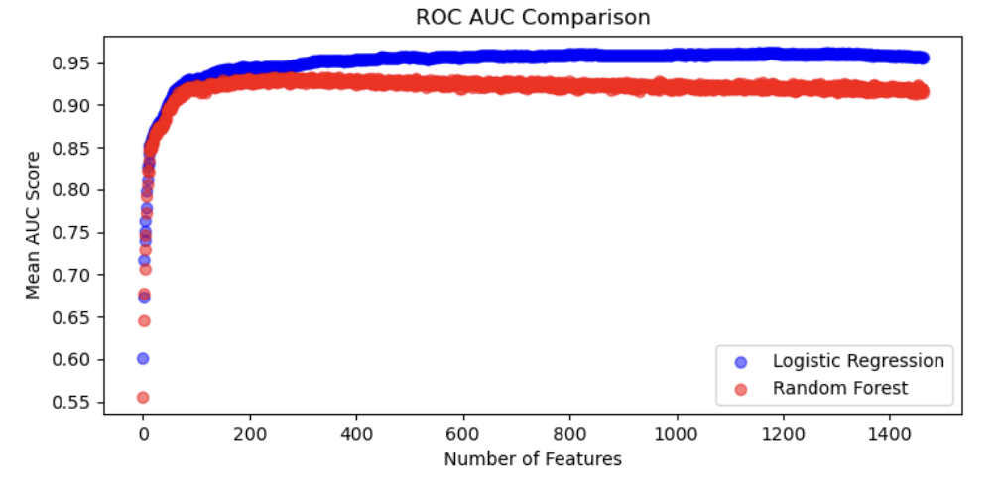

## Table of Contents
1. Introduction
2. Combine Data sets & Exploratory Data Analysis
3. Modeling Approach
4. Conclusion and Future Directions

## Introduction

Blood protein profiles serve as a rich source of information about physiological and pathological states. Proteins in the blood originate from various tissues and reflect processes such as inflammation, immune responses, and metabolism. Research shows that the blood proteome differs significantly between healthy individuals and those with diseases such as cancer, cardiovascular disease, diabetes, and autoimmune disorders. Establishing baseline profiles for healthy individuals and identifying deviations associated with diseases can enable early diagnosis, prognostic assessment, and therapeutic monitoring.

## Combine Data Sets & Exploratory Data Analysis 

All datasets utilized Olink technology for profiling the blood plasma proteome of the subjects. This method generates measurments in the form of NPX values, representing the relative abundance indices of specific proteins in individual patients or healthy subjects. 

We first compared a published blood plasma proteome dataset from a Southern German population-representative cohort (used as our control) with multiple combined cancer datasets, with the goal of training a model capable of detecting abnormalities in the plasma proteome. This was because many studies have demonstrated that blood protein profiles can discriminate between health and disease states.

For machine learning modeling, the primary predictor variable was the disease status—categorized as either cancer or control—and, in some cases, the specific cancer type. In exploratory data analysis, we visualized the dataset using various techniques, including principal component analysis, correlation matrix interactive heatmap, bar plot, Swarm plots, and pair plots to investigate the relationship between cancer type and expression of each tested protein. 

**Published datasets include:**

[Pancancer](https://pmc.ncbi.nlm.nih.gov/articles/PMC10354027/): (Plasma profiles of 1463 proteins from more than 1400 cancer patients)

[Healthy cohort](https://pubs.acs.org/doi/full/10.1021/acs.jproteome.0c00641?casa_token=jmZDPVZOvegAAAAA%3ARv_oH-9X2AfOxbH826lXOOUjBr8xhagsxlecoH2jrUE_aaJUsM1bINZ_g4RxtZSuMI0B1D3th1VilHUy8w): (728 proteins from 173 patients in a Southern German population-based cohort)

[Hodgkin's lymphoma](https://aacrjournals.org/cancerrescommun/article/4/7/1726/746418) (HL): (92 proteins in 167 samples collected from 54 patients)

[Esophageal cancer](https://pmc.ncbi.nlm.nih.gov/articles/PMC10836376/): (92 proteins from 91 patients)

There were [49 proteins in common](DataCleaning_and_ExploratoryAnalysis/ExploratoryAnalysis.ipynb) across these 4 datasets. The data for the 49 proteins in common across the 4 datasets was [combined](DataCleaning_and_ExploratoryAnalysis) into [Combined_df2.csv](DataCleaning_and_ExploratoryAnalysis/Combined_df2.csv). The data for the 1463 proteins from the Pancancer dataset was [compiled](DataCleaning_and_ExploratoryAnalysis) into [pancancer.csv](DataCleaning_and_ExploratoryAnalysis/pancancer.csv). 

**Exploratory Data Analysis can be found in the notebooks:**

PCA analysis: [PCA.ipynb](https://github.com/parinazfathi/ErdosFall2024ProteinTeam/blob/main/DataCleaning_and_ExploratoryAnalysis/PCA.ipynb)

Correlation Matrices: [Correlation_Matrix.ipynb](DataCleaning_and_ExploratoryAnalysis/Correlation_Matrix.ipynb)

Swarm plots & Bar plots: [ExploratoryDataAnalysis_barandswarmplots.ipynb](DataCleaning_and_ExploratoryAnalysis/ExploratoryDataAnalysis_barandswarmplots.ipynb)

Pairplots: [Pairplots.ipynb](https://github.com/parinazfathi/ErdosFall2024ProteinTeam/blob/main/DataCleaning_and_ExploratoryAnalysis/Pairplots.ipynb)

## Modeling Approach

**Objective 1: Distinguishing Between Cancer and Non-Cancer**

To distinguish between cancer and non-cancer samples, we combined all of the cancer samples into one group and trained several models to use the 49 proteins to distinguish them from the control samples:

[This file](Modeling_Approaches/Objective_1_CancerVsNoncancer/Objective1_LogisticandKNN.ipynb) takes [Combined_df2.csv](DataCleaning_and_ExploratoryAnalysis/Combined_df2.csv) as an input and trains Logistic Regression and k-Nearest Neighbor (kNN) models. Logistic Regression was able to distinguish between the cancer and non-cancer groups with 100 % accuracy

**Objective 2: Distinguishing Between Different Types of Cancer**
Logistic Regression could distinguish between cancer and non-cancer samples with 100 % accuracy, so we then turned our focus to distinguishing between the different cancer types. The 49 proteins were not effective in distinguishing between the different cancer types, so we focused on the pancancer dataset, which has the levels of 1463 proteins for 1477 patients across a total of 12 different cancer types. To account for small sample sizes in some of the cancer types, several categories were combined into a "blood cancer" category, for a total of 9 different cancer types. 

The following models were run (taking [combined_df.csv](DataCleaning_and_ExploratoryAnalysis/combined_df.csv) and [pancancer.csv](DataCleaning_and_ExploratoryAnalysis/pancancer.csv) as the inputs):

1. Logistic Regression: tested for distinguishing nine types of cancer with the best accuracy (Accuracy: 0.76, F1 score score:0.75, ROC AUC: 0.95) among the other models.

2. K-Nearest Neighbors (KNN): tested for distinguishing nine types of cancer (Accuracy: 0.39, F1 score: 0.40, ROC AUC: 0.82). Multiple K has been tested to improve the performance.

    **More details can be found in the notebook: Logistic Regression & KNN_pancancer_bloodcancer combined_May.ipynb**

3. [Random Forest](Modeling_Approaches/Objective_2_TypeOfCancer/Objective2_RandomForest&ExtraTrees.ipynb): tested for distinguishing nine types of cancer (Accuracy:0.6528, F-1 score:0.6536, ROC AUC: 0.9189). We also visually compare Random Forest and Logistic 
Regression. Additionally, despite GridSearchCV and hyperparameter optimization, Random Forest exhibited significant overfitting(with high variance between training and testing sets), and the model ran too slowly with GridSearchCV. 

4. [Extra Trees](Modeling_Approaches/Objective_2_TypeOfCancer/Objective2_RandomForest&ExtraTrees.ipynb): tested for distinguishing nine types of cancer (Accuracy: 0.6096, F-1 score:0.6119, ROC AUC: 0.9029). This model also struggled with overfitting, similar to Random Forest, and faced computational challenges when dealing with large datasets.

5. [XGBoost](Modeling_Approaches/Objective_2_TypeOfCancer/Objective2_XGBoost.ipynb): tested for distinguishing nine different types of cancer (Accuracy: 0.7138, F1 score: 0.7123, ROC AUC: 0.9471). 

6. [Multinomial regression](https://github.com/parinazfathi/ErdosFall2024ProteinTeam/blob/main/Modeling_Approaches/Objective_2_TypeOfCancer/Multinomial_imputedkNN_updated.ipynb): tested for distinguishing nine different types of cancer (Accuracy: 0.5932, F-1 score: 0.5920, ROC AUC: 0.9122). 

**Objective 3: Minimizing the Number of Features Needed to Distinguish Between Different Types of Cancer**
Since Logistic Regression was the best performing model in distinguishing between the different cancer types, we then turned our focus to minimizing the number of features that would be needed to effectively distinguish between the different cancers. Using fewer proteins to distinguish between the different cancer types would make these blood tests more practical and less costly for real-world applications.
Here is a [comparison](Modeling_Approaches/Objective_2_TypeOfCancer/Logistic&RandomForestVisualizations(num_features=all).ipynb) of Logistic Regression and Random Forest using various numbers of features to see the effects of the number of features on F-1 scores and ROC-AUC.

  

We then [compared](Modeling_Approaches/Objective_3/Objective3_Logistic.ipynb) the use of all 1463 proteins with the use of the 200 best proteins (determined by SelectKBest) for Logistic Regression. We observed a decrease in model performance (Accuracy fell from 0.7567 to 0.7331; ROC AUC fell from 0.9596 to 0.9486; F-1 score fell from 0.7519 to 0.7324) but these small decreases in performance may be worth the significant reduction in the number of proteins that would need to be tested for each patient.  

## Conclusion and Future Directions

**Model performance:**

Logistic Regression outperforms the other tested and optimized models for both Cancer vs. Control classification and cancer type classification. Logistic regression maintains relatively high performance when the number of features used for modeling is minimized to just the 200 k-Best proteins.

**Outlook:**

While combining datasets offers numerous advantages, challenges such as batch effects, variability in sample collection, and differences in assay platforms must be addressed. Although we used Olink technology in this study, many other datasets employ different methods for protein measurement. Testing our model's performance on other datasets, including datasets with other cancer types or that were collected using alternative methods could provide valuable insights into its robustness and generalizability.

