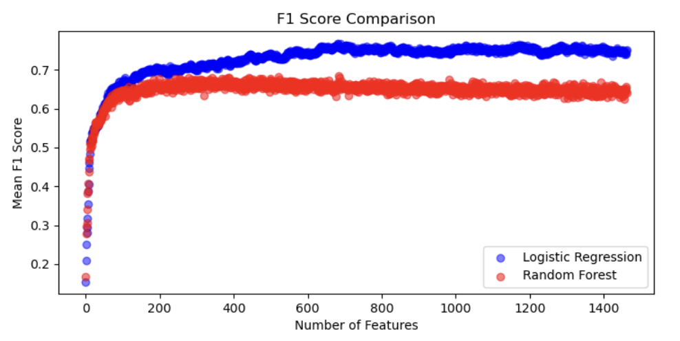

## Table of Contents
1. Introduction
2. Combine Data sets & Exploratory Data Analysis
3. Modeling Approach
4. Conclusion and Future Directions

## Introduction

Blood protein profiles serve as a rich source of information about physiological and pathological states. Proteins in the blood originate from various tissues and reflect processes such as inflammation, immune responses, and metabolism. Research shows that the blood proteome differs significantly between healthy individuals and those with diseases such as cancer, cardiovascular disease, diabetes, and autoimmune disorders. Establishing baseline profiles for healthy individuals and identifying deviations associated with diseases can enable early diagnosis, prognostic assessment, and therapeutic monitoring.

## Combine Data Sets & Exploratory Data Analysis 

All datasets utilized Olink technology for profiling the plasma proteome of the subjects. 
We first utilize a published plasma proteome dataset from healthy individuals with the goal of training a model capable of detecting abnormalities in the plasma proteome. The reason is based on the observation that many studies have demonstrated that blood protein profiles can discriminate between health and disease states. 

We also combined the multiple cancer datasets for enhanced predictive modeling. This method generates variables in the form of NPX values, representing the relative abundance indices of specific proteins in individual patients or healthy subjects. 

For machine learning modeling, the primary predictor variable was the disease status—categorized as either cancer or healthy—and, in some cases, the specific cancer type. We visualized the dataset using various techniques, including principal component analysis, correlation matrix interactive heatmap, bar plot, Swarm plot, pair plot, etc., to investigate the relationship between cancer type and expression of each tested protein. 

**Published datasets include:**

[Pancancer](https://pmc.ncbi.nlm.nih.gov/articles/PMC10354027/): (Plasma profiles of 1463 proteins from more than 1400 cancer patients)

[Healthy cohort](https://pubs.acs.org/doi/full/10.1021/acs.jproteome.0c00641?casa_token=jmZDPVZOvegAAAAA%3ARv_oH-9X2AfOxbH826lXOOUjBr8xhagsxlecoH2jrUE_aaJUsM1bINZ_g4RxtZSuMI0B1D3th1VilHUy8w): (49 protein from 173 Southern German population-based cohort)

[Hodgkin lymphoma](https://aacrjournals.org/cancerrescommun/article/4/7/1726/746418) (HL): (49 protein from 54 patients)

[Esophageal cancer](https://pmc.ncbi.nlm.nih.gov/articles/PMC10836376/): (49 protein from 91 patients)

**Exploratory Data Analysis can be found in the notebooks:**

PCA analysis: [PCA.ipynb](DataCleaning_and_ExploratoryAnalysis/PCA.ipynb)

Correlation: [Correlation_Matrix.ipynb](DataCleaning_and_ExploratoryAnalysis/Correlation_Matrix.ipynb)

Swarm plots & Bar plots: [ExploratoryDataAnalysis_barandswarmplots.ipynb](DataCleaning_and_ExploratoryAnalysis/ExploratoryDataAnalysis_barandswarmplots.ipynb)

Pairplot: [Pairplots.ipynb](DataCleaning_and_ExploratoryAnalysis/Pairplots.ipynb)

## Modeling Approach

**Objective 1: Distinguishing Between Cancer and Non-Cancer**

To distinguish between cancer and non-cancer samples, we combined all of the cancer samples into one group and trained several models to use the 49 proteins to distinguish them from the control samples:

[This file](RunningAll4Models_PF2.ipynb) takes [Combined_df2.csv](DataCleaning_and_ExploratoryAnalysis/Combined_df2.csv) as an input and trains Logistic Regression and k-Nearest Neighbor (kNN) models. Logistic Regression was able to distinguish between the cancer and non-cancer groups with 100 % accuracy

**Objective 2: Distinguishing Between Different Types of Cancer**
Logistic Regression could distinguish between cancer and non-cancer samples with 100 % accuracy, so we then turned our focus to distinguishing between the different cancer types. The 49 proteins were not effective in distinguishing between the different cancer types, so we focused on the pancancer dataset, which has the levels of 1463 proteins for 1477 patients across a total of 12 different cancer types. To account for small sample sizes in some of the cancer types, several categories were combined into a "blood cancer" category, for a total of 9 different cancer types. 

The following models were run (taking [combined_df.csv](DataCleaning_and_ExploratoryAnalysis/combined_df.csv) and [pancancer.csv](DataCleaning_and_ExploratoryAnalysis/pancancer.csv) as the inputs):

1. Logistic Regression: tested for distinguishing nine types of cancer with the best accuracy (Accuracy: 0.76, F1 score score:0.75, ROC AUC: 0.95) among the other models.

2. K-Nearest Neighbors (KNN): tested for distinguishing nine types of cancer (Accuracy: 0.39, F1 score: 0.40, ROC AUC: 0.82). Multiple K has been tested to improve the performance.

    **More details can be found in the notebook: Logistic Regression & KNN_pancancer_bloodcancer combined_May.ipynb**

3. [Random Forest](Modeling_Approaches/Objective_2_TypeOfCancer/Objective2_RandomForest&ExtraTrees.ipynb): tested for distinguishing nine types of cancer (Accuracy:0.6528, F-1 score:0.6536, ROC AUC: 0.9189). We also visually compare Random Forest and Logistic 
Regression. Additionally, despite GridSearchCV and hyperparameter optimization, Random Forest exhibited significant overfitting(with high variance between training and testing sets), and the model ran too slowly with GridSearchCV. 

4. [Extra Trees](Modeling_Approaches/Objective_2_TypeOfCancer/Objective2_RandomForest&ExtraTrees.ipynb): tested for distinguishing nine types of cancer (Accuracy: 0.6096, F-1 score:0.6119, ROC AUC: 0.9029). This model also struggled with overfitting, similar to Random Forest, and faced computational challenges when dealing with large datasets.

5. [XGBoost](RunningAll4Models_UPDATED_PF5.ipynb): tested for distinguishing nine different types of cancer (Accuracy: 0.6528, F1 score: 0.65, ROC AUC: 0.92). 

6. [Multinomial regression](https://github.com/parinazfathi/ErdosFall2024ProteinTeam/blob/main/Modeling_Approaches/Objective_2_TypeOfCancer/Multinomial_imputedkNN_updated.ipynb): tested for distinguishing nine different types of cancer (Accuracy: 0.5932, F-1 score: 0.5920, ROC AUC: 0.9122). 

**Objective 3: Minimizing the Number of Features Needed to Distinguish Between Different Types of Cancer**
Since Logistic Regression was the best performing model in distinguishing between the different cancer types, we then turned our focus to minimizing the number of features that would be needed to effectively distinguish between the different cancers. 
Here is [comparison](Modeling_Approaches/Objective_2_TypeOfCancer/Logistic&RandomForestVisualizations(num_features=all).ipynb) for Logistic Regression and Random Forest to see effects of number of features on F-1 scores and ROC-AUC.

  

## Conclusion and Future Directions

**Model performance:**

Logistic Regression outperforms the other tested and optimized models, achieving the highest accuracy when the number of features used for modeling is minimized (feature number = 200).

**Outlook:**

While combining datasets offers numerous advantages, challenges such as batch effects, variability in sample collection, and differences in assay platforms must be addressed. Although we used Olink technology in this study, many other datasets employ different methods for protein measurement. Testing our model's performance on datasets collected using alternative methods could provide valuable insights into its robustness and generalizability.

